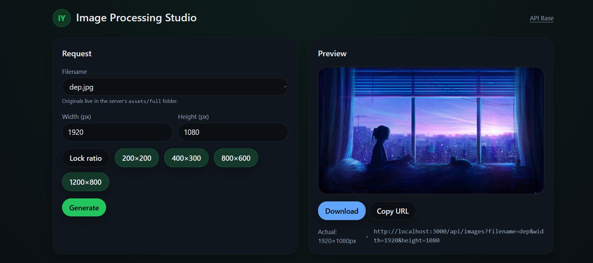

# Image Processing Studio

<p align="center">
  <a href="./docs/logo.png">
    
  </a>
</p>

<p align="center">
  <strong>Fast, type-safe image resizing API with a beautiful React UI</strong><br/>
  Express + Sharp + TypeScript · React + Vite + Tailwind v3 · Jasmine tests
</p>

<p align="center">
  </a>
  
  
  
  
  
  
  
</p>

<p align="center">
  
</p>

<p align="center">
  <a href="./docs/demo.mp4">▶️ Watch 60s demo</a>
</p>

---

## Table of Contents
- [Highlights](#highlights)
- [Architecture](#architecture)
- [Monorepo Layout](#monorepo-layout)
- [Quick Start](#quick-start)
  - [Backend (Express API)](#backend-express-api)
  - [Frontend (React UI)](#frontend-react-ui)
- [API Reference](#api-reference)
- [Frontend (UI) Features](#frontend-ui-features)
- [Testing](#testing)
- [CI](#ci)
- [Conventional Commits](#conventional-commits)
- [Troubleshooting](#troubleshooting)
- [Errors](#Errors)


---

## Highlights
- ⚡️ **Blazing-fast** resizing via **Sharp** with on-disk caching.
- 🔒 **Type-safe** API (TypeScript) + strict query validation.
- 🧪 **Jasmine + Supertest**: health/list/resize tests all green.
- 🖼️ **Modern UI** (React + Vite + **Tailwind v3**): ratio lock, presets, smooth **fade+scale** animation, shimmer & spinner while loading, download/copy URL.
- 🧰 Dev-friendly: ESLint + Prettier, LF line endings, unified `.gitignore`.
- 🧭 Clean repo history following **Conventional Commits**.

---


**Notes**
- **Validation first**: `filename` (no extension), positive `width` & `height`.
- **Deterministic cache key**: `filename_w{W}_h{H}.jpg` → re-requests are instant.
- **Error handling**: `400` for bad params, `404` if original missing.
- **Separation of concerns**: routes → controller → services (`sharp`) → utils (`fs`, `cache`, `validate`).

---
## Architecture

```text
[ Client (React UI) ]
        │  REST over HTTP
        ▼
[ Express API ] ──► validate query ──► compute cache key ──►
        │                                           │
        ▼                                           ▼
  load original (assets/full/*.jpg)          serve from cache if exists
        │                                           │
        └─────────────── Sharp resize ──────────────┘


```
## Monorepo Layout
```
image-processing-api/ 
├─ server/ # Express + Sharp + TypeScript + Jasmine tests
│ ├─ src/
│ │ ├─ app.ts # Express app (exports default app)
│ │ ├─ server.ts # boots the HTTP server
│ │ ├─ config/ # PORT, ASSETS_FULL, CACHE_DIR
│ │ ├─ routes/images.ts
│ │ ├─ controllers/images.controller.ts
│ │ ├─ services/resize.service.ts
│ │ └─ utils/{validate,cache,file}.ts
│ ├─ assets/full/ # originals (tracked empty via .gitkeep)
│ └─ cache/ # generated variants (ignored)
└─ web/image-ui/ # React + Vite + Tailwind v3 UI
├─ src/
│ ├─ components/{Logo,Spinner,TransitionImage}.tsx
│ ├─ lib/api.ts
│ └─ App.tsx
├─ tailwind.config.cjs, postcss.config.cjs, vite.config.ts
└─ .env (VITE_API_BASE)
```

---

# Quick Start

## Backend (Express API)
```
cd server
npm install
npm run dev
# API on http://localhost:3000
```
## Frontend (React UI)
```
cd web/image-ui
npm install
npm run dev
# UI on http://localhost:5173  (expects API at http://localhost:3000)
```
## Configure API base via:
```
web/image-ui/.env
VITE_API_BASE=http://localhost:3000
```
## API Reference
### Health
```
GET /health
→ 200 { ok: true, ts: 1712345678901 }
```
### List originals
```
GET /api/images/list
→ 200 { images: ["gaza","palestine","..."] }
```
### Resize
```
GET /api/images?filename=NAME&width=W&height=H
```
## Testing

Run server tests (Jasmine):

```bash
cd server
npm test
# ✓ 5 specs, 0 failures


```
## CI
```
name: Server Tests
on:
  push: { paths: ['server/**', '.github/workflows/server-tests.yml'] }
  pull_request: { paths: ['server/**'] }
jobs:
  test:
    runs-on: ubuntu-latest
    defaults:
      run:
        working-directory: server
    steps:
      - uses: actions/checkout@v4
      - uses: actions/setup-node@v4
        with:
          node-version: 20
          cache: npm
          cache-dependency-path: server/package-lock.json
      - run: npm ci
      - run: npm test
```
## Conventional Commits
```
feat(api): add resize endpoint

feat(web): implement animated preview

fix(images): handle missing filename

chore(repo): update gitignore

test(server): add resize error cases

ci(server): run tests on PR
```
## Troubleshooting
```
CORS or 404 from UI
Set VITE_API_BASE=http://localhost:3000 or add a Vite proxy in vite.config.ts.

Image not found
Ensure original exists at server/assets/full/<name>.jpg (query uses the name without extension).

node_modules tracked
```
## Errors
```
 400 → invalid parameters

 404 → original image not found
```
